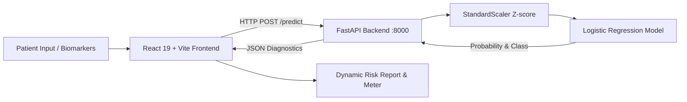

# 🫀 CardioDetect - Cardiovascular Disease Risk Detection System

[](https://fastapi.tiangolo.com)
[](https://react.dev)
[](https://vitejs.dev)
[](https://scikit-learn.org)
[](https://www.python.org)
[](LICENSE)

An end-to-end clinical machine learning system for early detection and risk stratification of **Cardiovascular Disease (CVD)**. The application integrates a trained Scikit-Learn pipeline (`cardio_model.pkl`) with a high-performance **FastAPI** backend and an interactive multi-page **React + Vite** frontend.

Trained on **70,000 verified patient medical examinations** from the Kaggle Cardiovascular Disease dataset.

---

## ✨ Features

### 1. 🩺 Clinical Risk Assessment
- **Real-Time ML Inference**: Calculates cardiovascular disease probability directly from the trained pipeline (`cardio_model.pkl`).
- **11 Physiological Biomarkers**: Evaluates age, gender, height, weight, systolic/diastolic blood pressure, cholesterol, glucose, smoking, alcohol, and physical activity.
- **Dynamic Metrics**: Instant BMI calculation with clinical weight category and blood pressure stage detection.
- **Explainable Results**: Highlights specific contributing risk factors (e.g., Stage 2 Hypertension, High Cholesterol Level 3, Sedentary Lifestyle) and generates customized lifestyle recommendations based on AHA and WHO guidelines.
- **Pre-Selected Baseline**: Opens with clean, pre-selected parameters for a standard 30%–35% risk baseline (~32.5% risk), with 1-click test profiles for healthy adults and high-risk seniors.
- **Printable Medical Summary**: One-click print/export report feature.

### 2. 📊 Dataset & Properties Dashboard
- **Kaggle CVD Dataset Analytics**: Visualizes statistics across 70,000 records with a balanced 50/50 CVD class distribution.
- **11 Features Explorer**: Searchable and filterable cards displaying dataset means, standard deviations, clinical reference ranges, and disease prevalence.
- **Model Feature Importance Ranking**: Bar chart of logistic regression odds ratio coefficients highlighting that Systolic Blood Pressure (`+6.037`), Age (`+0.368`), and Cholesterol (`+0.356`) dominate risk determination, while Physical Activity (`-0.083`) provides protective benefits.
- **Interactive Biomarker Simulator**: Sliders to test sensitivity in real time and see how varying BP, age, or weight shifts the predicted probability curve.

### 3. ℹ️ About & Machine Learning Architecture
- **Pipeline Breakdown**: Visualizes the end-to-end data flow: Data Ingestion ➔ StandardScaler ➔ Logistic Regression ➔ FastAPI ➔ React SPA.
- **Biomarkers Reference Table**: In-depth medical definitions and physiological relevance for all 11 variables.
- **Interactive API Documentation**: Live Swagger UI specifications and JSON schemas.

---

## 🏗️ System Architecture



---

## 📁 Project Directory Structure

```plaintext
Sahil/
├── COMMANDS.txt               # Quick reference of all install & run commands
├── README.md                  # Project documentation
├── .gitignore                 # Git ignore rules
│
├── backend/                   # FastAPI Python Microservice
│   ├── cardio_model.pkl       # Trained Scikit-Learn Pipeline model
│   ├── main.py                # FastAPI REST API endpoints (/predict, /health, /model-info)
│   └── requirements.txt       # Python dependencies (FastAPI, scikit-learn, etc.)
│
└── frontend/                  # React + Vite Single Page Application
    ├── package.json           # Node.js dependencies (React 19, Lucide, Vite)
    ├── vite.config.js         # Vite configuration with backend proxy
    ├── .env                   # Environment config (VITE_BACKEND_BASE)
    ├── .env.example           # Environment template
    ├── index.html             # Application entry HTML
    └── src/
        ├── App.jsx            # Main view router & tab navigation
        ├── App.css            # Custom CSS styling (dark mode, glassmorphism)
        ├── index.css          # Design system variables & animations
        ├── components/
        │   ├── Header.jsx         # Navigation bar & live backend status pill
        │   ├── AssessmentPage.jsx # Risk assessment form & result gauge
        │   ├── DashboardPage.jsx  # Dataset properties & interactive simulator
        │   ├── AboutPage.jsx      # ML architecture, pipeline & biomarker table
        │   └── Footer.jsx         # Footer with links and citations
        ├── data/
        │   └── datasetInfo.js     # 70,000 patient statistics, weights & presets
        └── services/
            └── api.js             # API client with automatic offline fallback
```

---

## 🚀 Getting Started

### Prerequisites
- **Python**: Version 3.9 or higher
- **Node.js**: Version 18.0 or higher (with npm)

---

### Step 1: Install Dependencies

#### 1. Backend (Python):
```powershell
cd backend
pip install -r requirements.txt
```

#### 2. Frontend (Node.js):
```powershell
cd frontend
npm install
```

---

### Step 2: Run the Application

You will need **two terminal windows** open simultaneously:

#### Terminal 1 — Start the FastAPI Backend:
```powershell
cd backend
python -m uvicorn main:app --reload --port 8000
```
- **API Server**: `http://127.0.0.1:8000`
- **Swagger Documentation**: `http://127.0.0.1:8000/docs`
- **Health Check**: `http://127.0.0.1:8000/health`

#### Terminal 2 — Start the React Frontend:
```powershell
cd frontend
npm run dev
```
- **Web App URL**: `http://localhost:5173/`

---

## 📡 API Reference

### 1. Predict Cardiovascular Risk
- **Endpoint**: `POST /predict`
- **Content-Type**: `application/json`

#### Request Body Example:
```json
{
  "age_years": 54.0,
  "gender": 2,
  "height": 175.0,
  "weight": 82.0,
  "ap_hi": 140,
  "ap_lo": 90,
  "cholesterol": 2,
  "gluc": 1,
  "smoke": 0,
  "alco": 0,
  "active": 1
}
```

#### Response Example:
```json
{
  "prediction": 1,
  "risk_level": "High Risk",
  "risk_color": "#ef4444",
  "probability_disease": 0.7642,
  "probability_no_disease": 0.2358,
  "confidence": 0.7642,
  "bmi": 26.8,
  "bmi_category": "Overweight",
  "contributing_factors": [
    "Elevated Blood Pressure (Stage 2 Hypertension: 140/90 mmHg)",
    "Borderline High Cholesterol (Above Normal)",
    "Overweight Range (BMI 26.8 kg/m²)"
  ],
  "recommendations": [
    "Schedule a clinical BP checkup and reduce sodium intake below 2,000 mg/day.",
    "Adopt a heart-healthy diet low in saturated fats and request a full lipid panel."
  ]
}
```

### 2. Health & Model Status
- **Endpoint**: `GET /health` or `GET /api/health`
- **Response**:
```json
{
  "status": "ok",
  "service": "CardioPredict Inference API",
  "model_loaded": true,
  "features_expected": ["age_years", "gender", "height", "weight", "ap_hi", "ap_lo", "cholesterol", "gluc", "smoke", "alco", "active"]
}
```

### 3. Model Information & Dataset Statistics
- **Endpoint**: `GET /model-info`
- Returns model architecture, coefficients, scaler means, scales, and dataset metadata for dashboard visualization.

---

## 🧠 Machine Learning Model Details

| Attribute | Specification |
| :--- | :--- |
| **Dataset** | Kaggle Cardiovascular Disease Dataset |
| **Cohort Size** | 70,000 Patient Records |
| **Target Variable** | `cardio` (0 = Healthy, 1 = Presence of CVD) |
| **Preprocessing** | `StandardScaler` (Z-score standard deviation normalization) |
| **Classifier** | `LogisticRegression(max_iter=2000)` with L2 regularization |
| **Model File** | `backend/cardio_model.pkl` |
| **Approx. Accuracy** | ~73.2% |
| **ROC AUC** | 0.79 |

---

## 🛠️ Tech Stack

- **Frontend**: React 19, Vite 8, Lucide React, Vanilla CSS3 (Custom design system with dark mode & glassmorphism)
- **Backend**: FastAPI, Uvicorn, Pydantic
- **Machine Learning**: Scikit-Learn, Pandas, NumPy, Joblib

---

## ⚠️ Medical Disclaimer

This project is created strictly for **educational, academic research, and artificial intelligence demonstration purposes**. It is **not** a certified medical diagnostic tool or medical device. Statistical predictions made by this model must never substitute for clinical diagnosis, consultation, or treatment by a qualified healthcare professional.

---

## 📄 License

This project is licensed under the MIT License - see the [LICENSE](LICENSE) file for details.
